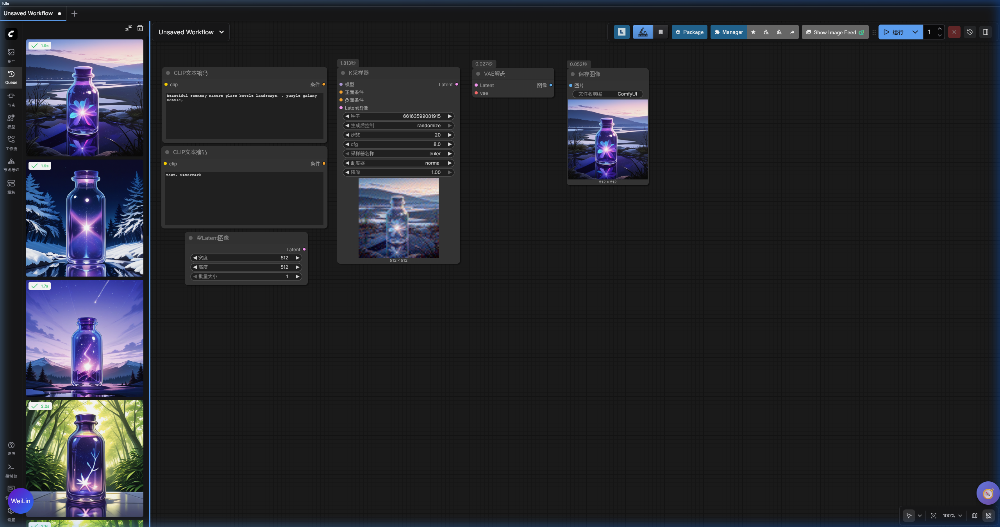

<p align="center">
  
</p>

<h1 align="center">ComfyUI Queue Sidebar</h1>

<p align="center">
  <b>Bring back the old Queue Panel with image previews.</b>
</p>

<p align="center">
  English | <a href="README_zhTW.md">繁體中文</a>
</p>

<p align="center">
  <a href="#installation">Install</a> ·
  <a href="#features">Features</a> ·
  <a href="#motivation">Why?</a>
</p>

---

## Motivation

The new ComfyUI frontend (v1.33.1+) removed the sidebar Queue Panel with image previews and replaced it with a minimal queue list at the top. This change left many users without an easy way to browse generation results at a glance.

**comfyui_queue_sidebar** brings back the old queue panel to the sidebar as a custom node — no frontend file modifications required.

---

## Features

| Feature                     | Description                                                                    |
| --------------------------- | ------------------------------------------------------------------------------ |
| 🖼️ **Image Grid**           | Responsive grid of running / pending / completed tasks with thumbnail previews |
| 🎬 **Video Support**        | Hover to auto-play video outputs (webm, mp4)                                   |
| 🔄 **Live Preview**         | Real-time progress preview during generation (K-Sampler etc.)                  |
| 📐 **Resize Friendly**      | Grid adapts from single column to multi-column as you resize the sidebar       |
| 🏷️ **Status Tags**          | Color-coded tags with animated spinner for running tasks                       |
| 🖱️ **Context Menu**         | Right-click to delete a task or load its workflow                              |
| 🔢 **Pending Badge**        | Sidebar icon shows count of pending tasks                                      |
| 🧹 **Clear All**            | One-click button to clear the entire queue & history                           |
| ⚡ **No Frontend Patching** | Custom-node plugin — no frontend source files are modified                     |

---

## Installation

### Via ComfyUI Manager (Recommended)

Search for **`comfyui_queue_sidebar`** in [ComfyUI Manager](https://github.com/ltdrdata/ComfyUI-Manager) and click Install.

### Manual

```bash
cd ComfyUI/custom_nodes
git clone https://github.com/Zhen-Bo/comfyui_queue_sidebar.git
```

Restart ComfyUI. The **Queue** tab will appear in the sidebar (between "Assets" and "Node Library").

---

## Uninstallation

Delete the `comfyui_queue_sidebar` folder from `custom_nodes/`.

---

## Compatibility

- **ComfyUI frontend** v1.33.1+ (tested on 1.35.9)
- Works alongside the built-in bottom-panel queue without conflicts
- The plugin uses the public extension API for registration and events. It additionally hooks a small number of internal APIs (e.g. `app.queuePrompt`, sidebar tab ordering) to provide a seamless experience — all such integration points are centralized in [`comfyAdapter.js`](web/lib/comfyAdapter.js) with feature detection and graceful degradation if the upstream shape changes

---

## License

[MIT](LICENSE)
