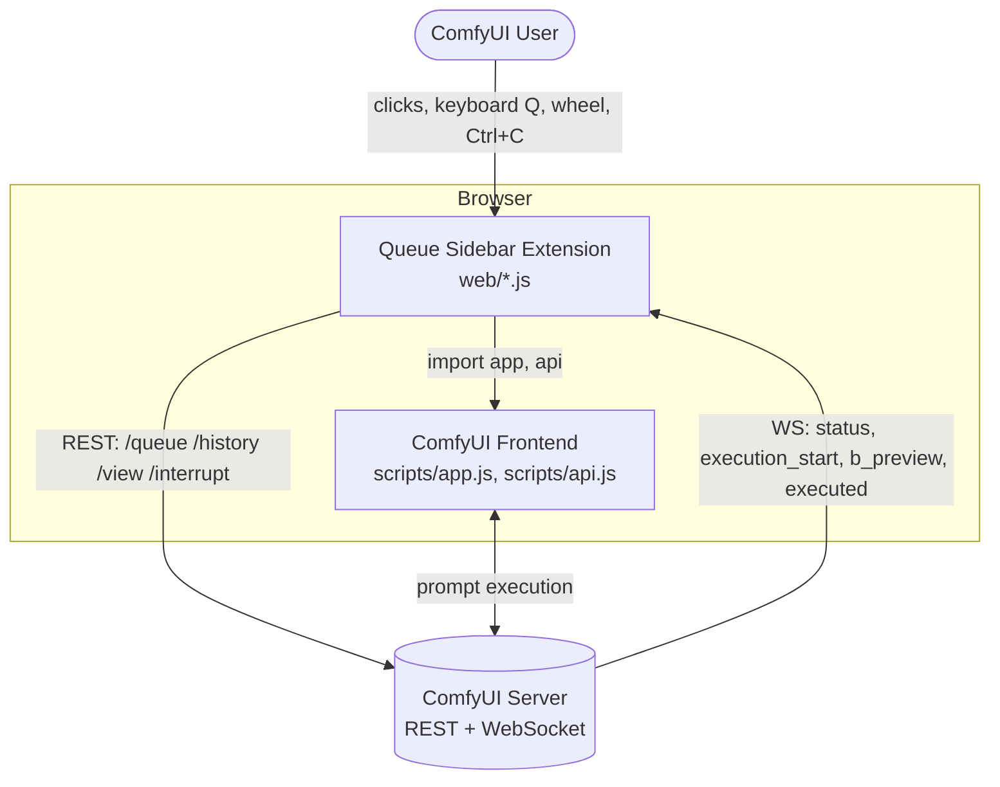
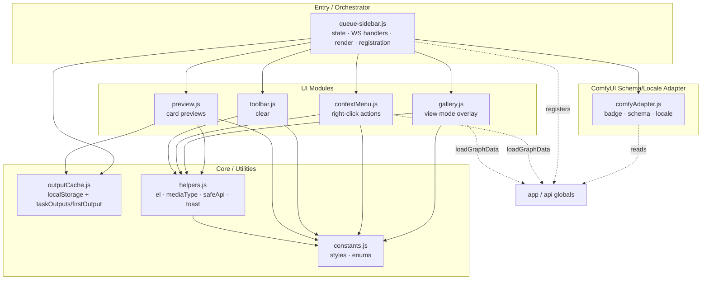
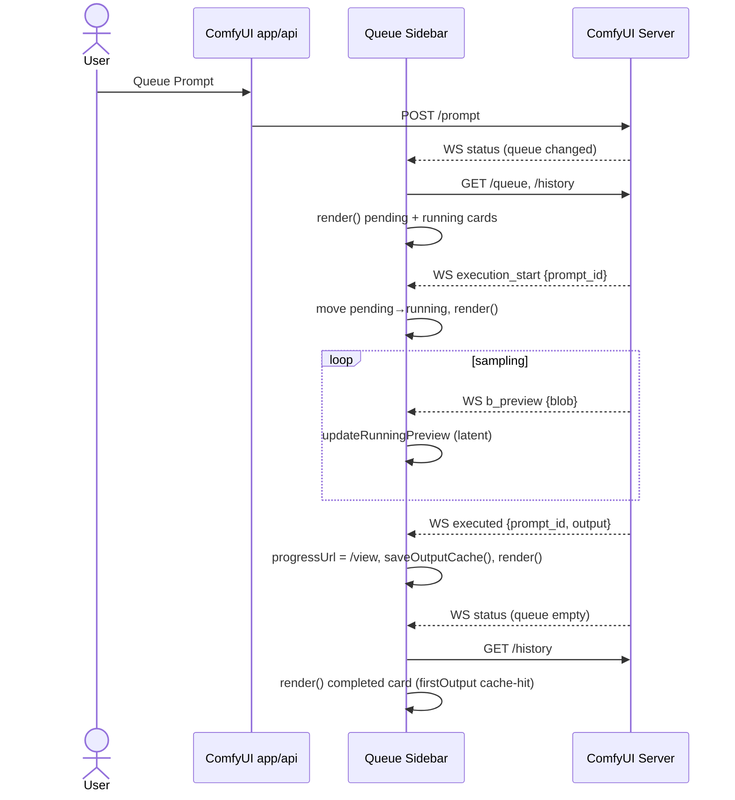
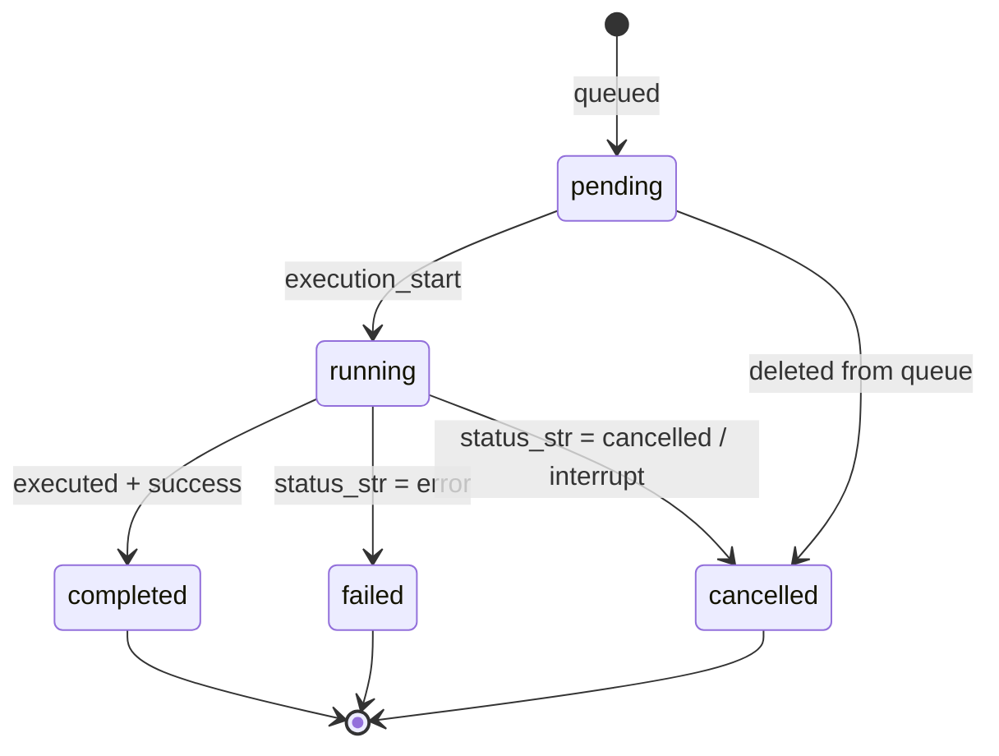

# ComfyUI Queue Sidebar — Architecture

- **Status:** Living document
- **Related:** [SPEC.md](./SPEC.md)

> Diagrams use Mermaid so they render natively on GitHub and version alongside the code.
> The C4 layers below are expressed as Mermaid flowcharts for reliable rendering.

---

## 1. Overview

The extension is a set of **Vanilla JS ES modules** loaded by ComfyUI from `web/` (declared
by `WEB_DIRECTORY` in `__init__.py`). The browser executes them as native modules that
`import` ComfyUI's own `app` and `api` globals. There is no build step and no runtime
dependency. `comfyAdapter.js` centralizes ComfyUI schema and locale adaptation; a small
number of direct `app` calls exist elsewhere at named call sites — sidebar
registration/toggle in `queue-sidebar.js`, and `app.loadGraphData` in `contextMenu.js` and
`gallery.js`.

---

## 2. C4 — System Context



---

## 3. C4 — Containers / Components

Module responsibilities and their layering. Arrows show `import` direction.



---

## 4. Runtime Sequence — Execution lifecycle

How a queued prompt flows from submission to a completed card. In 1.3.0 the refresh after
submission is driven purely by the `status` event (the previous `queuePrompt` monkey-patch
is removed).



---

## 5. State Machine — Task lifecycle



---

## 6. Data Flow

How output data moves between the server, extension state, the cache, and the DOM —
including the two new view-mode sinks (clipboard, workflow loader).

```mermaid
flowchart LR
    server[(ComfyUI Server)]
    state[Extension state<br/>running · pending · history]
    render[render + preview]
    dom[ComfyUI DOM<br/>sidebar cards]
    cache[(localStorage<br/>lastOutput)]
    gallery[view mode overlay]
    clip[(Clipboard)]
    graph[app.loadGraphData]

    server -->|REST + WS incl. executed| state
    state --> render --> dom
    state -->|onExecuted: saveOutputCache| cache
    cache -->|taskOutputs/firstOutput| render
    dom -->|click card| gallery
    gallery -->|Ctrl+C: fetch original blob| clip
    gallery -->|Load workflow| graph
```

---

## 7. Key design decisions

| Decision | Where | Rationale |
|---|---|---|
| Vanilla JS, no framework / build | whole `web/` | native ES modules; no framework or build step |
| Centralized schema/locale adapter | `comfyAdapter.js` | one file to update when the queue/history schema or locale setting shape changes upstream |
| Decouple from ComfyUI internals | remove tab-reorder + queuePrompt patch | registry compliance + upgrade safety |
| Cache-first, single-node output resolution | `outputCache.js` | correct image for multi-stage workflows; never flattens across nodes |
| Feature-detected degradation | `comfyAdapter.js` | never break ComfyUI if internals move |

---

## 8. Module reference

| Module | Responsibility | Tests |
|---|---|---|
| `queue-sidebar.js` | Entry: state, WS handlers, render loop, extension registration | (e2e) |
| `comfyAdapter.js` | ComfyUI coupling: badge, schema normalization, locale | `comfyAdapter.test.js` |
| `preview.js` | Card preview rendering (image/video/running/pending) | `preview.test.js` |
| `gallery.js` | View mode overlay: nav, zoom, pan, copy, load workflow | `gallery.test.js` *(new)* |
| `contextMenu.js` | Right-click actions per status | `contextMenu.test.js` |
| `toolbar.js` | Clear pending + interrupt (shared drawer-button helper for reveal/hide), clear history (hold to clear all) | `toolbar.test.js` |
| `outputCache.js` | `localStorage` cache + `taskOutputs`/`firstOutput` resolvers | `outputCache.test.js` |
| `helpers.js` | `el`, `mediaType`, `safeApi`, `showToast` | `helpers.test.js` |
| `constants.js` | Shared styles, extension enums | — |

---

## 9. Asset Licensing

The queue sidebar uses an inline SVG derived from Lucide's `list-x` icon for the Clear Pending toolbar button (`toolbar.js`).

- **Origin**: [Lucide Icons](https://lucide.dev) (`list-x`)
- **License**: ISC License
- **Copyright**: Copyright (c) 2026 Lucide Icons and Contributors
- **License text**: https://github.com/lucide-icons/lucide/blob/main/LICENSE
