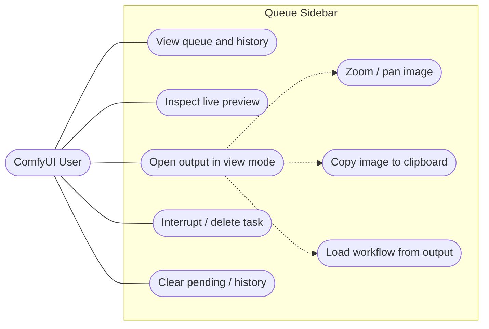

# ComfyUI Queue Sidebar — Software Specification

- **Status:** Living document
- **Targets:** 1.4.0
- **Audience:** maintainers, contributors, ComfyUI extension developers
- **Related:** [ARCHITECTURE.md](./ARCHITECTURE.md)

---

## 1. Overview

ComfyUI Queue Sidebar is an **in-process ComfyUI frontend extension** that restores a
queue/history panel with live image previews inside ComfyUI's sidebar. It shows pending,
running, and completed tasks as a card grid; updates the running card in real time from
WebSocket events; and lets the user open any output in a full-screen viewer ("view mode").

It ships as static `web/*.js` loaded by ComfyUI via `WEB_DIRECTORY` — **no build step, no
runtime dependencies**.

### Goals

- Bring back an always-visible queue/history panel with thumbnails.
- Reflect execution state (queue → running → done) with minimal latency.
- Show the *correct* output for multi-stage workflows (e.g. upscaling) — not just the
  first node's image.
- Provide a fast full-screen viewer for inspecting, copying, and re-loading outputs.

### Non-Goals

- Not a standalone web app; it lives inside ComfyUI's page and DOM.
- No server-side / Python logic (`__init__.py` only declares `WEB_DIRECTORY`).
- No database; the only persistence is a bounded `localStorage` cache.
- No UI framework or build pipeline.

---

## 2. Actors & Use Cases

The only actor is the **ComfyUI User** operating the ComfyUI web interface.

---

## 3. Functional Requirements

### FR-1 — Queue & history display
- Render a card grid combining `pending`, `running`, and `history` tasks (`queue-sidebar.js#render`).
- Order: pending → running → history; cards keyed by `promptId` for stable reconciliation.
- Empty state shows a "no tasks" placeholder.
- Each card shows a status tag (running/pending/completed/failed/cancelled) and, when known,
  execution time.

### FR-2 — Real-time preview
- During sampling, update the running card from `b_preview` WS events (latent blob previews).
- On each `executed` WS event, switch the running card to the decoded `/view` output and
  persist the selected output to the cache (`outputCache.saveOutputCache`).
- Completed/historical cards resolve their thumbnail via `firstOutput(outputs, promptId)`,
  which prefers the cached output and falls back to dict iteration (backward compatible).
- **Every card preview is contained, with no user-facing fit setting.** An image fills its
  cell as a blurred, over-scaled copy of itself with the whole picture laid on top
  (`preview.fillContain`), so cells are always full and nothing is ever cropped. Live
  previews are composed identically to finished ones — previously the running card was
  hardcoded to `object-fit:cover`, so every generation ended with the picture visibly
  reframing as the finished output replaced the last streamed frame. Video is plain
  `contain` without the blurred backdrop, which would cost a second decoder per visible cell.

### FR-3 — Task status lifecycle
- Status transitions follow the state machine in [ARCHITECTURE.md](./ARCHITECTURE.md#5-state-machine--task-lifecycle).
- Failed and cancelled tasks are derived from the `/history` `status_str`.

### FR-4 — View mode (full-screen viewer)
Opening a completed image/video card opens a full-screen overlay (`gallery.js`).

- **FR-4.1 Baseline sizing** — the image fits the viewport at `max-width:90vw; max-height:90vh;
  object-fit:contain` (this is the "minimum size" baseline; zoom scales up from here).
- **FR-4.2 Navigation** — prev/next arrows, `←`/`→` keys, counter; close via `✕`, `Esc`, or
  backdrop click.
- **FR-4.3 Wheel zoom** *(new in 1.3.0)* — scroll to zoom, step `±0.12`, clamped to
  `[1, 4]`, centered on the image. At scale `1` the offset resets. Responds anywhere over the
  overlay, including the dark surround — not just the image; drag-pan (FR-4.4) stays bound to
  the image element itself.
- **FR-4.4 Drag-pan** *(new)* — when zoomed (`scale > 1`), press-and-hold to drag-pan
  (pointer capture); at scale `1` panning is disabled.
- **FR-4.5 Copy image** *(new)* — `Ctrl/⌘+C` copies the current image to the clipboard as a
  `ClipboardItem`. On success it shows a confirmation toast; on failure an error toast; it does
  **not** fall back to copying a URL. Applies to **images only**.

  > **Metadata is _not_ preserved — a browser-platform limit, not a bug.** The async Clipboard
  > API re-encodes images on write (Chromium/WebKit decode to a bitmap and emit a fresh PNG to
  > defend against decompression-bomb attacks), which drops ComfyUI's embedded workflow
  > (`tEXt`/`iTXt` chunks); the standard write path also accepts only `image/png`, so non-PNG
  > outputs are rejected outright. The one byte-exact escape hatch (web custom formats,
  > `web image/png`) needs the *receiving* app to opt in, so it would not restore the workflow
  > on paste. `Ctrl+C` is therefore a pixel-level "copy image", not a metadata transport — to
  > recover the workflow use the **Load-workflow button (FR-4.6)** or download the original file
  > from `/view` (raw bytes, chunks intact; saving bypasses clipboard sanitization).
- **FR-4.6 Load workflow button** *(new)* — a translucent-grey button (white icon) to the left of the red `✕` that,
  when the output carries a workflow, exits view mode and calls `app.loadGraphData(workflow)` —
  equivalent to the right-click "Load workflow". Hidden when no workflow is available.
- **FR-4.7 Scope** — zoom/pan/copy apply to **images only**; video keeps current behaviour.
- **FR-4.8 Help hint** *(new)* — a non-interactive top-left bar listing the viewer controls
  (`←/→`, wheel-zoom, drag-pan, `Ctrl+C`, `Esc`).
- **FR-4.9 Entrance/exit** *(new)* — the backdrop and content are separate layers with a staged
  entrance (backdrop fades in over 140ms, then content fades + scales up from `.96` over 180ms)
  and a single shared 100ms fade-out on close. The Load workflow path (FR-4.6) closes instantly
  with no fade instead, since `app.loadGraphData` blocks the main thread and a mid-flight
  transition would freeze and snap.

### FR-5 — Context menu
Right-click a card (`contextMenu.js`):
- Running → **Interrupt** (`POST /interrupt`).
- Pending → **Delete** (`POST /queue {delete}`).
- Completed/failed/cancelled → **Delete** (`POST /history {delete}`), and **Load workflow**
  when `task.workflow` is present (`app.loadGraphData`).
- Entrance is a 120ms opacity + scale animation, origin-aware — the menu grows from whichever
  corner it ends up pinned to after flipping away from a screen edge. Dismissal stays instant and
  now also fires on `pointerdown` outside the menu (not just `click`), so a press-and-hold
  elsewhere — e.g. the toolbar's clear-history hold — closes the menu the instant the press
  starts.

### FR-6 — Toolbar
- Three buttons in order left→right: `[clear-pending] [interrupt] [trash]`, right-aligned, **clear history last** so it stays pinned to the right edge.
  The row grows and shrinks leftwards, and the button users aim for by position never moves.
- **Clear pending** clears only the waiting queue (`POST /queue {clear}`), single click
  (`toolbar.createClearPendingButton`). Uses an inline SVG `list-x` icon (derived from Lucide Icons, ISC license).
  It is **present or absent, never dimmed**, and appears only once the queue has been
  non-empty for `CLEAR_PENDING_REVEAL_DELAY_MS` (500ms) — submitting a single prompt moves it from
  pending to running almost at once, and without the delay the button would flash into view
  and straight back out. There is no matching delay on the way out: an empty queue starts the
  retract fade immediately. Clicking the button instead skips that retract altogether,
  disappearing at once for instant confirmation — the same active-click/passive-hide split
  documented for interrupt below.
- **Interrupt running** interrupts the currently active execution (`POST /interrupt`), single click
  (`toolbar.createInterruptButton`). Uses PrimeIcons `pi-stop` icon. It is **present or absent, never dimmed**,
  appearing immediately (`INTERRUPT_REVEAL_DELAY_MS` = 0) when `running` is non-empty. When a user actively clicks it,
  it hides immediately without delay or retract animation for instant confirmation; when `running` empties passively (task finishes naturally), it hides after a 300ms
  debounce (`INTERRUPT_HIDE_DELAY_MS` = 300ms) to prevent UI flicker between back-to-back tasks.
- **Clear history** clears only the history (`POST /history {clear}`) on a click; holding it
  for `HOLD_DURATION_MS` fills a progress ring and then clears everything (`POST /queue {clear}` → `POST /interrupt` if running → `POST /history {clear}`)
  (`toolbar.createClearHistoryButton`). An armed hold that is released early does nothing.
- **Clear history is never disabled or dimmed** and its hold is always available; a press
  with nothing to delete simply makes no request. The receding cards during a hold are what
  report the blast radius (including any active running task, which is interrupted as part of clearing all). Upon hold completion, receded cards deepen (opacity → 0, scale → .94) until render/refresh clears them, preventing snap-back resurrection.
  A tap reuses that same exit, scoped to the history cards alone — `POST /history` spares pending and running, so fading them would misreport what the press
  destroys. The request is issued in the same tick as the fade rather than behind it, and removal waits for whichever settles last, so a fast reply cannot yank
  the cards out mid-transition.
- Colour states the 3-tier severity hierarchy: clear history carries the single standing red severity accent (`DANGER`) because it permanently destroys non-reproducible outputs. Interrupt rests at crisp active text colour (`#eee`) to clearly state its status as a live control during execution without creating competing red noise, and illuminates red on hover before click to signal danger intent. Clear pending rests at muted grey (`#888`) and brightens on hover, as it cancels a queue plan that can be resubmitted.

### FR-7 — Internationalization
- Labels load from `web/locales/<locale>.json`, locale read from ComfyUI's `Comfy.Locale`
  setting; English is the fallback (`comfyAdapter.getComfyLocale`, `queue-sidebar.js#t`).

### FR-8 — ComfyUI integration
- Register a sidebar tab + toggle command/keybinding (`Q`).
- Maintain an icon badge showing `running + pending` count.
- **Tab ordering:** uses ComfyUI's default registration order. *(Changed in 1.3.0 — the
  previous `sidebarTabs` array mutation is removed for registry compliance and upgrade safety.)*
- **Queue refresh:** driven by the `status` WS event. *(Changed in 1.3.0 — the previous
  `queuePrompt` monkey-patch is removed.)*

---

## 4. Non-Functional Requirements

- **NFR-1 Zero build / zero deps** — ships as native ES modules.
- **NFR-2 Graceful degradation** — the ComfyUI-internal touch points `comfyAdapter.js` owns
  (badge, schema, locale) are feature-detected and fail into a logged "degraded mode" rather than
  throwing. A few direct `app` calls elsewhere (sidebar registration in `queue-sidebar.js`;
  `app.loadGraphData` in `contextMenu.js`/`gallery.js`) call stable, public ComfyUI APIs directly
  and are not individually guarded.
- **NFR-3 Registry compliance** — minimize patterns that trigger Comfy Registry security
  review; avoid mutating ComfyUI internals where an official API or event exists.
- **NFR-4 Testability** — DOM-producing logic is unit-tested with Vitest + jsdom; each `lib/`
  module has a matching `tests/*.test.js`.
- **NFR-5 Performance** — rendering uses keyed reconciliation; running-card previews update in
  place without full rebuilds, falling back to a full `render()` only when no running card is
  currently on screen. Card hover scale (`preview.js`) is a pure CSS `:hover` rule gated behind
  `@media (hover:hover) and (pointer:fine)` with a `prefers-reduced-motion` opt-out — a status
  change rebuilds the card element outright, and CSS `:hover` re-evaluates against the
  replacement immediately, where a JS-driven hover would leave it stuck un-hovered under a still
  pointer.
- **NFR-6 Resilience** — API failures show a toast and return `null` (`helpers.safeApi`);
  cache writes fail silently on quota errors.

---

## 5. Data Contracts

### 5.1 ComfyUI REST (via `api.fetchApi`)
| Endpoint | Method | Use |
|---|---|---|
| `/queue` | GET | running + pending tuples → `normalizeQueue` |
| `/queue` | POST | `{delete:[id]}` / `{clear:true}` |
| `/history?max_items=N` | GET | history map → `normalizeHistoryItem` |
| `/history` | POST | `{delete:[id]}` / `{clear:true}` |
| `/view?filename&subfolder&type` | GET | output image/video URL |
| `/interrupt` | POST | stop running task |

### 5.2 WebSocket events (`api.addEventListener`)
| Event | Payload | Effect |
|---|---|---|
| `status` | queue counts | trigger `refresh()` |
| `execution_start` | `{prompt_id}` | move pending→running immediately |
| `b_preview` | image blob | update running card latent preview |
| `executed` | `{prompt_id, output}` | set `/view` preview + `saveOutputCache` |

### 5.3 localStorage
- Key `queueSidebar.lastOutput`: `{ [promptId]: [{ filename, subfolder, type }, ...] }` — every
  item from the single winning node (see `outputCache.taskOutputs`), bounded to
  `OUTPUT_CACHE_MAX = 200` (oldest evicted). Entries written before the value was an array are a
  bare object; `loadOutputCache` wraps them into a one-element array on read.
- `galleryItems()` (`queue-sidebar.js`) flattens every history task's `taskOutputs` into the
  view-mode item list, so opening the lightbox (FR-4) walks every output of every task, not just
  the first — the user-visible consequence of the array-based cache above.

### 5.4 Workflow extraction
- `workflow = item.prompt[3].extra_pnginfo.workflow` (deeply nested; guarded — may be `null`).

---

## 6. Verification

Automated (Vitest): each `lib/` module has unit tests; new view-mode interactions add
`tests/gallery.test.js`. End-to-end behaviour (Playwright) covers load, card ordering,
real-time preview, output cache, view mode, context menu, toolbar, and i18n; acceptance
requires a running ComfyUI instance.

---

## 7. Glossary

| Term | Meaning |
|---|---|
| **Task / card** | One queued prompt, shown as a grid card, identified by `promptId`. |
| **View mode** | The full-screen image/video overlay (`gallery.js`). |
| **Output cache** | `localStorage` map of the winning node's output items per prompt (array). |
| **Coupling point** | `comfyAdapter.js` — owns ComfyUI schema/locale adaptation; a small number of other modules (`queue-sidebar.js`, `contextMenu.js`, `gallery.js`) call stable ComfyUI APIs directly. |
| **Degraded mode** | State after a feature-detected ComfyUI internal is missing; logged, non-fatal. |
| **`firstOutput`** | Resolver that picks the output to display, cache-first. |
