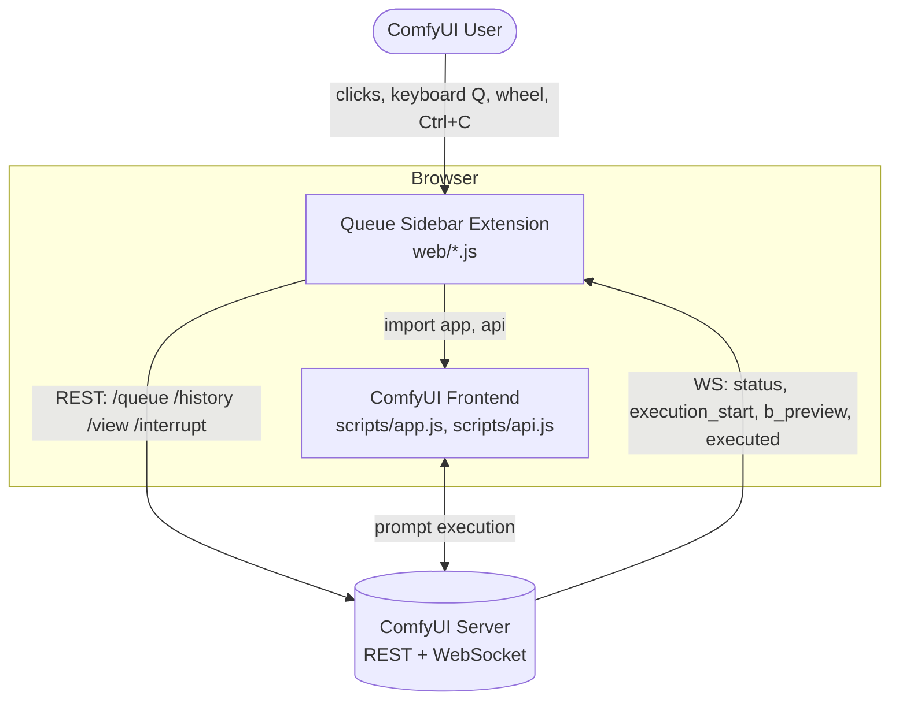
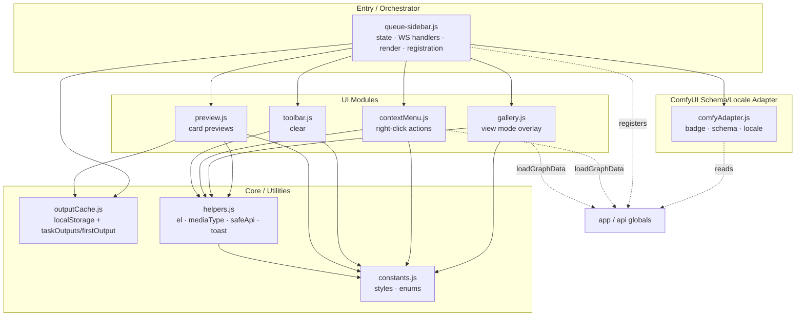
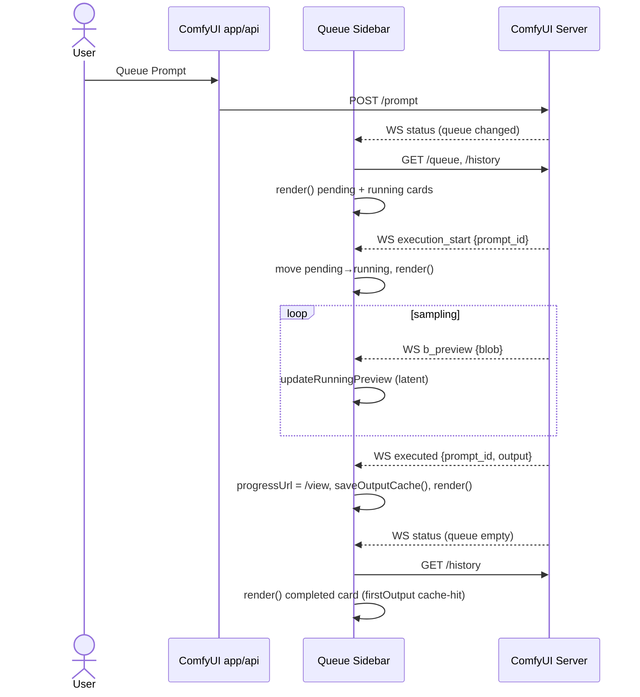
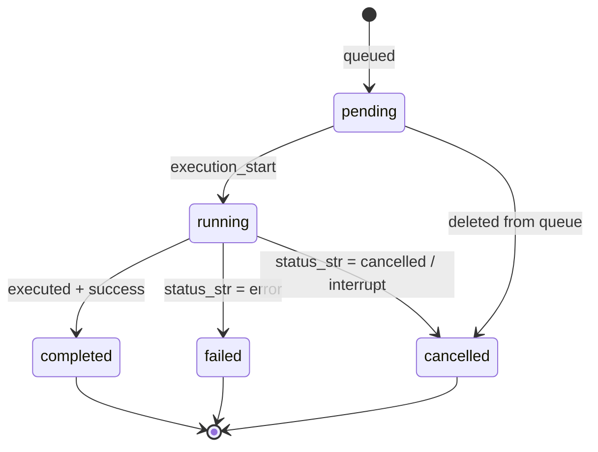

# ComfyUI Queue Sidebar — 架構

- **狀態：** 持續維護文件
- **相關：** [SPEC.md](./SPEC.md)
- **English:** [../ARCHITECTURE.md](../ARCHITECTURE.md)

> 圖表使用 Mermaid，可在 GitHub 原生渲染並隨程式碼一起版控。以下 C4 分層以 Mermaid flowchart
> 表達以確保可靠渲染。

---

## 1. 概述

本擴充是一組由 ComfyUI 從 `web/` 載入的 **Vanilla JS ES modules**（由 `__init__.py` 的
`WEB_DIRECTORY` 宣告）。瀏覽器將其作為原生模組執行，`import` ComfyUI 自己的 `app` 與 `api`
全域物件。無建置步驟、無執行期相依。ComfyUI 的 schema 與 locale 轉接集中於
`comfyAdapter.js`；少數直接呼叫 `app` 的地方則分散在明確可指出的幾個呼叫點——
`queue-sidebar.js` 的側邊欄註冊／切換，以及 `contextMenu.js`、`gallery.js` 中的
`app.loadGraphData`。

---

## 2. C4 — 系統情境（System Context）



---

## 3. C4 — 容器／元件（Containers / Components）

模組職責與其分層。箭頭表示 `import` 方向。



---

## 4. 執行時序 — 執行生命週期

一個排入佇列的 prompt 如何從送出流動到完成的卡片。在 1.3.0 中，送出後的刷新純由 `status`
事件驅動（先前的 `queuePrompt` monkey-patch 已移除）。



---

## 5. 狀態機 — 任務生命週期



---

## 6. 資料流

輸出資料如何在伺服器、擴充狀態、快取與 DOM 之間流動——包含兩個新的 view-mode 出口
（剪貼簿、工作流程載入器）。

```mermaid
flowchart LR
    server[(ComfyUI Server)]
    state[Extension state<br/>running · pending · history]
    render[render + preview]
    dom[ComfyUI DOM<br/>sidebar cards]
    cache[(localStorage<br/>lastOutput)]
    gallery[view mode overlay]
    clip[(Clipboard)]
    graph[app.loadGraphData]

    server -->|REST + WS incl. executed| state
    state --> render --> dom
    state -->|onExecuted: saveOutputCache| cache
    cache -->|taskOutputs/firstOutput| render
    dom -->|click card| gallery
    gallery -->|Ctrl+C: fetch original blob| clip
    gallery -->|Load workflow| graph
```

---

## 7. 關鍵設計決策

| 決策 | 位置 | 理由 |
|---|---|---|
| Vanilla JS，無框架／建置 | 整個 `web/` | 原生 ES modules；無框架或建置步驟 |
| 集中式 schema／locale 轉接層 | `comfyAdapter.js` | 佇列／歷史 schema 或 locale 設定上游變更時，只需更新一個檔案 |
| 與 ComfyUI 內部解耦 | 移除 tab 重排 + queuePrompt 補丁 | registry 合規 + 升級安全 |
| 快取優先、單節點的輸出解析 | `outputCache.js` | 對多階段工作流程顯示正確圖片；不跨節點累加 |
| 功能偵測降級 | `comfyAdapter.js` | ComfyUI 內部移動時絕不弄壞它 |

---

## 8. 模組參照

| 模組 | 職責 | 測試 |
|---|---|---|
| `queue-sidebar.js` | 進入點：狀態、WS handlers、render 迴圈、擴充註冊 | (e2e) |
| `comfyAdapter.js` | ComfyUI 耦合：badge、schema 正規化、locale | `comfyAdapter.test.js` |
| `preview.js` | 卡片預覽渲染（image/video/running/pending） | `preview.test.js` |
| `gallery.js` | View mode 覆蓋層：導覽、縮放、平移、複製、載入工作流程 | `gallery.test.js`（新） |
| `contextMenu.js` | 依狀態的右鍵動作 | `contextMenu.test.js` |
| `toolbar.js` | 清除等待中／中斷執行中（共用的抽屜式按鈕輔助函式）、清除歷史（長按同時清除全部） | `toolbar.test.js` |
| `outputCache.js` | `localStorage` 快取 + `taskOutputs`/`firstOutput` 解析器 | `outputCache.test.js` |
| `helpers.js` | `el`、`mediaType`、`safeApi`、`showToast` | `helpers.test.js` |
| `constants.js` | 共用樣式、擴充列舉 | — |

---

## 9. 圖示授權說明

側邊欄工具列的「清除等待中」按鈕（`toolbar.js`）採用 Lucide 的 `list-x` 圖形衍生創作。

- **來源**：[Lucide Icons](https://lucide.dev) (`list-x`)
- **授權**：ISC License
- **版權宣告**：Copyright (c) 2026 Lucide Icons and Contributors
- **授權全文**：https://github.com/lucide-icons/lucide/blob/main/LICENSE
