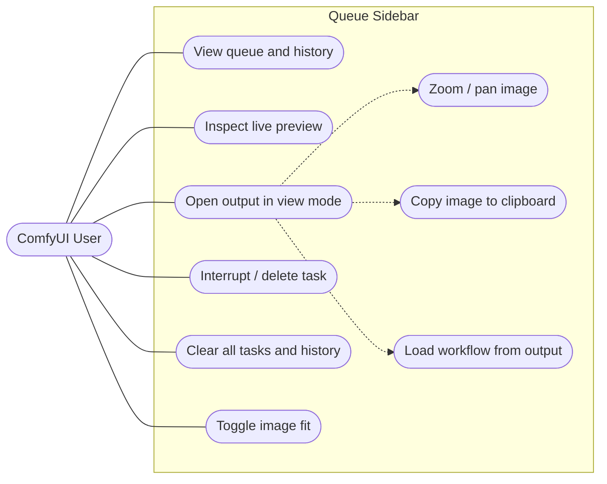

# ComfyUI Queue Sidebar — 軟體規格

- **狀態：** 持續維護文件
- **目標版本：** 1.3.0
- **對象：** 維護者、貢獻者、ComfyUI 擴充開發者
- **相關：** [ARCHITECTURE.md](./ARCHITECTURE.md)
- **English:** [../SPEC.md](../SPEC.md)

---

## 1. 概述

ComfyUI Queue Sidebar 是一個**行程內（in-process）的 ComfyUI 前端擴充**，在 ComfyUI 側邊欄
中還原了帶即時圖片預覽的佇列／歷史面板。它以卡片網格顯示等待中、執行中與已完成的任務；
從 WebSocket 事件即時更新執行中的卡片；並讓使用者在全螢幕檢視器（「view mode」）中開啟任何輸出。

它以靜態 `web/*.js` 形式由 ComfyUI 透過 `WEB_DIRECTORY` 載入——**無建置步驟、無執行期相依**。

### 目標

- 還原一個常駐可見、帶縮圖的佇列／歷史面板。
- 以最小延遲反映執行狀態（佇列 → 執行中 → 完成）。
- 對多階段工作流程（如放大）顯示**正確**的輸出——而非只顯示第一個節點的圖片。
- 提供快速的全螢幕檢視器，用於檢視、複製與重新載入輸出。

### 非目標

- 不是獨立的 web 應用；它存在於 ComfyUI 的頁面與 DOM 之中。
- 無伺服器端／Python 邏輯（`__init__.py` 僅宣告 `WEB_DIRECTORY`）。
- 無資料庫；唯一的持久化是一個有界的 `localStorage` 快取。
- 無 UI 框架或建置流程。

---

## 2. 角色與使用情境

唯一的角色是操作 ComfyUI 網頁介面的**ComfyUI 使用者**。

---

## 3. 功能需求

### FR-1 — 佇列與歷史顯示
- 以卡片網格合併顯示 `pending`、`running` 與 `history` 任務（`queue-sidebar.js#render`）。
- 排序：pending → running → history；卡片以 `promptId` 為 key 以利穩定的協調（reconciliation）。
- 空狀態顯示「無任務」佔位。
- 每張卡片顯示狀態標籤（running/pending/completed/failed/cancelled），已知時並顯示執行時間。

### FR-2 — 即時預覽
- 取樣期間，從 `b_preview` WS 事件更新執行中的卡片（latent blob 預覽）。
- 每個 `executed` WS 事件時，將執行中卡片切換為解碼後的 `/view` 輸出，並將所選輸出持久化到快取
  （`outputCache.saveOutputCache`）。
- 已完成／歷史卡片透過 `firstOutput(outputs, promptId)` 解析縮圖——優先取用快取，未命中則
  退回字典逐一走訪（向後相容）。

### FR-3 — 任務狀態生命週期
- 狀態轉換遵循 [ARCHITECTURE.md](./ARCHITECTURE.md#5-state-machine--task-lifecycle) 的狀態機。
- 失敗與取消狀態由 `/history` 的 `status_str` 導出。

### FR-4 — View mode（全螢幕檢視器）
點擊已完成的圖片／影片卡片會開啟全螢幕覆蓋層（`gallery.js`）。

- **FR-4.1 基準尺寸** —— 圖片以 `max-width:90vw; max-height:90vh; object-fit:contain` 適配視窗
  （此即「最小尺寸」基準；縮放由此往上放大）。
- **FR-4.2 導覽** —— 上一張／下一張箭頭、`←`/`→` 鍵、計數器；以 `✕`、`Esc` 或點背景關閉。
- **FR-4.3 滾輪縮放**（1.3.0 新增）—— 滾動縮放，步進 `±0.12`，範圍限制 `[1, 4]`，以圖片中心為錨點。
  縮放至 1 時位移歸零。
- **FR-4.4 拖曳平移**（新增）—— 放大時（`scale > 1`），按住即可拖曳平移（pointer capture）；
  於 scale 1 時停用平移。
- **FR-4.5 複製圖片**（新增）—— `Ctrl/⌘+C` 將當前圖片以 `ClipboardItem` 複製到剪貼簿。成功時顯示
  確認 toast，失敗時顯示錯誤 toast；**不**退回複製網址。**僅限圖片**。

  > **不會保留 metadata——這是瀏覽器平台限制，而非 bug。** 非同步 Clipboard API 在寫入時會重新編碼
  > 圖片（Chromium/WebKit 先解碼成點陣圖、再輸出全新的 PNG，以防禦解壓縮炸彈攻擊），因而丟棄 ComfyUI
  > 內嵌的 workflow（`tEXt`/`iTXt` chunk）；標準寫入路徑又只接受 `image/png`，故非 PNG 輸出會被直接
  > 拒絕。唯一能保留位元組的手段（web custom formats，`web image/png`）需要**接收端** app 主動 opt-in，
  > 因此貼上時仍無法還原 workflow。所以 `Ctrl+C` 只是像素層級的「複製圖片」，並非 metadata 傳輸——要
  > 取回 workflow 請用 **Load-workflow 按鈕（FR-4.6）**，或從 `/view` 下載原始檔（原始位元組、chunk
  > 完整；存檔不經過剪貼簿 sanitize）。
- **FR-4.6 載入工作流程按鈕**（新增）—— 紅色 `✕` 左側的半透明灰底按鈕（白色 icon），當輸出帶有 workflow 時，退出 view
  mode 並呼叫 `app.loadGraphData(workflow)`——等同於右鍵的「Load workflow」。無 workflow 時隱藏。
- **FR-4.7 範圍** —— 縮放／平移／複製**僅適用圖片**；影片維持現有行為。
- **FR-4.8 操作提示**（新增）—— 左上角不可互動的長條，列出檢視器控制方式（`←/→`、滾輪縮放、拖曳平移、
  `Ctrl+C`、`Esc`）。

### FR-5 — 右鍵選單
右鍵點擊卡片（`contextMenu.js`）：
- 執行中 → **Interrupt**（`POST /interrupt`）。
- 等待中 → **Delete**（`POST /queue {delete}`）。
- 已完成／失敗／取消 → **Delete**（`POST /history {delete}`），且當 `task.workflow` 存在時顯示
  **Load workflow**（`app.loadGraphData`）。

### FR-6 — 工具列
- **圖片適配切換**（contain ↔ cover）重新渲染預覽（`toolbar.createFitButton`）。
- **全部清除** 附確認彈窗，清空佇列 + 歷史（`toolbar.createClearButton`）。

### FR-7 — 國際化
- 標籤自 `web/locales/<locale>.json` 載入，locale 讀取自 ComfyUI 的 `Comfy.Locale` 設定；
  英文為退回預設（`comfyAdapter.getComfyLocale`、`queue-sidebar.js#t`）。

### FR-8 — ComfyUI 整合
- 註冊側邊欄 tab + 切換命令／快捷鍵（`Q`）。
- 維護顯示 `running + pending` 數量的圖示 badge。
- **Tab 排序：** 使用 ComfyUI 的預設註冊順序。*（1.3.0 變更——先前的 `sidebarTabs` 陣列 mutation
  已移除，以符合 registry 合規與升級安全。）*
- **佇列刷新：** 由 `status` WS 事件驅動。*（1.3.0 變更——先前的 `queuePrompt` monkey-patch
  已移除。）*

---

## 4. 非功能需求

- **NFR-1 零建置／零相依** —— 以原生 ES modules 發布。
- **NFR-2 優雅降級** —— 每個 ComfyUI 內部接觸點皆有功能偵測，失敗時記錄為「降級模式」而非拋錯
  （`comfyAdapter.js`）。
- **NFR-3 Registry 合規** —— 盡量減少觸發 Comfy Registry 安全審查的模式；在有官方 API 或事件可用時
  避免 mutate ComfyUI 內部。
- **NFR-4 可測試性** —— 產生 DOM 的邏輯以 Vitest + jsdom 單元測試；每個 `lib/` 模組都有對應的
  `tests/*.test.js`。
- **NFR-5 效能** —— 渲染採用 keyed reconciliation；執行中卡片的預覽就地更新，不整體重建。
- **NFR-6 韌性** —— API 失敗顯示 toast 並回傳 `null`（`helpers.safeApi`）；快取寫入在配額錯誤時
  靜默失敗。

---

## 5. 資料契約

### 5.1 ComfyUI REST（透過 `api.fetchApi`）
| 端點 | 方法 | 用途 |
|---|---|---|
| `/queue` | GET | running + pending tuples → `normalizeQueue` |
| `/queue` | POST | `{delete:[id]}` / `{clear:true}` |
| `/history?max_items=N` | GET | history map → `normalizeHistoryItem` |
| `/history` | POST | `{delete:[id]}` / `{clear:true}` |
| `/view?filename&subfolder&type` | GET | 輸出圖片／影片網址 |
| `/interrupt` | POST | 停止執行中的任務 |

### 5.2 WebSocket 事件（`api.addEventListener`）
| 事件 | 內容 | 效果 |
|---|---|---|
| `status` | 佇列計數 | 觸發 `refresh()` |
| `execution_start` | `{prompt_id}` | 立即將 pending→running |
| `b_preview` | 圖片 blob | 更新執行中卡片的 latent 預覽 |
| `executed` | `{prompt_id, output}` | 設定 `/view` 預覽 + `saveOutputCache` |

### 5.3 localStorage
- Key `queueSidebar.lastOutput`：`{ [promptId]: { filename, subfolder, type } }`，上限
  `OUTPUT_CACHE_MAX = 200`（最舊者淘汰）。

### 5.4 工作流程擷取
- `workflow = item.prompt[3].extra_pnginfo.workflow`（深層巢狀；有防護——可能為 `null`）。

---

## 6. 驗證

自動化（Vitest）：每個 `lib/` 模組都有單元測試；新的 view-mode 互動新增 `tests/gallery.test.js`。
端對端行為（Playwright）涵蓋載入、卡片排序、即時預覽、輸出快取、view mode、右鍵選單、工具列與
國際化；驗收需要一個運行中的 ComfyUI 實例。

---

## 7. 術語表

| 術語 | 意義 |
|---|---|
| **Task / card（任務／卡片）** | 一個排入佇列的 prompt，以網格卡片顯示，由 `promptId` 識別。 |
| **View mode** | 全螢幕圖片／影片覆蓋層（`gallery.js`）。 |
| **Output cache（輸出快取）** | 每個 prompt 最後一個產生圖片之輸出的 `localStorage` 對應表。 |
| **Coupling point（耦合點）** | `comfyAdapter.js`——唯一接觸 ComfyUI 內部的模組。 |
| **Degraded mode（降級模式）** | 功能偵測發現 ComfyUI 內部缺失後的狀態；記錄且非致命。 |
| **`firstOutput`** | 決定顯示哪個輸出的解析器，快取優先。 |
